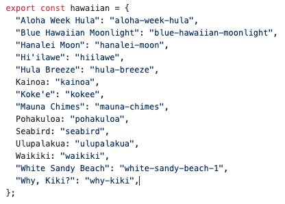
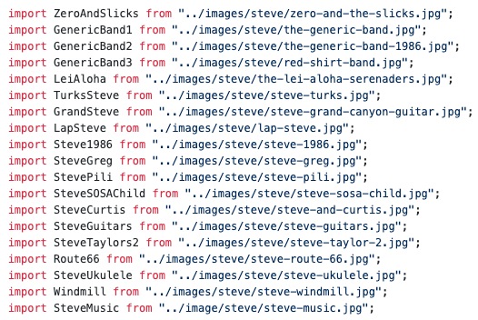
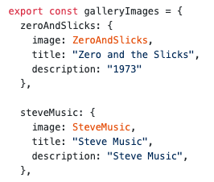
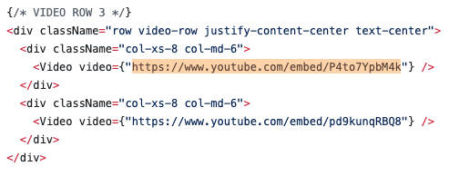
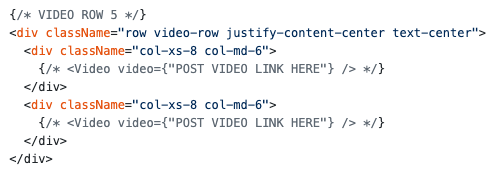

# Steve Yungen Music
https://steveyungen.herokuapp.com

Here are a few ways that you can update the text, photos, songs, and videos on the website. Just be careful not to delete or edit any of the other code outside of these areas or it could cause issues. 

It'll usually take 3-5 minutes for changes to show up on the website. 

## How to update text:
*Example: Updating About Steve text on Home Page.*

1) Go to src -> pages
2) Open Home.js
3) Click the Pencil icon in the top right corner (Edit this Page)
4) Scroll down until you see the About Steve text
5) Edit it
6) Click Commit Changes at the bottom of the page

## How to add or remove songs:
*Example: Adding a new Hawaiian song called "Why, Kiki?" to the Music page. Song is hosted on SoundCloud.*

Intro: You'll need the slug to the song on SoundCloud. Get this by opening the track in SoundCloud. The slug is the part at the end of the url, as shown here: "https://soundcloud.com/steve-yungen/[this-is-the-slug]". It'll be all lowercase and hyphenated. You'll see all the other examples of slugs in the songs.js file. 

1) Go to src -> content 
2) Open songs.js
3) Click the Pencil icon in the top right corner (Edit this Page)
4) Add a new line to the object titled "hawaiian"
5) Add the new song *exactly* in this format: "[TITLE]": "[SLUG]"

  

    
  

  
*Note: Don't forget the quotation marks or the comma at the end.*

6) Click Commit Changes at the bottom of the page

To remove a song, simply delete it from the list.

## How to add photos:
*Example: Adding a new picture called "Steve Music" to the Gallery page.*

#### Upload Photo
1) Save the image to your computer using a title such as "steve-music.jpg".
2) Go to src -> images -> steve
3) Drag and drop image into folder
4) Click Commit Changes

#### Import Photo
5) Go to src -> content
6) Open images.js
7) Click the Pencil icon in the top right corner (Edit this Page)
8) Import your new file using a title of your choice. Copy the import format already in place:

  

    
  

  
  
*Note: Don't forget the file extension or the semi-colon at the end of the statement.

  
#### Add Photo to Gallery Display
9) Add photo somewhere in the galleryImages object, mimicking the format already in place. The order of this list is the order photos appear on the website.

  

    
  

  
The name "steveMusic" is artibrary. Name it whatever you think makes sense. 
Make sure the file assigned to image matches the name of the file you imported, in this case, "SteveMusic".

10) Click Commit Changes

*Note: Be sure that you added commas at the end of each line and that there are no typos.

    
## Add or Remove a Video on Gallery Page

1) Go to src -> pages
2) Open Gallery.js
3) Click the Pencil icon in the top right corner (Edit this Page)
4) Scroll down until you see the video section

#### Replace a Video:
If you want to replace a video, simply change the URL of the replaced video to the new video. Make sure it's the /embed/ URL that you get from YouTube's Share/Embed function.

  

    
  

#### Add a Video:
As you'll see, I have the videos grouped into rows of two. That means there are eight videos (due to 2 * 4). If you end up adding more than two additional videos, just copy the code block shown below and paste it as the next row. When deleting videos, try to keep the two-per-row structure. 

I've left a fifth row with two empty Video components. You can paste your YouTube /embed/ URLs between the quotation marks as indicated. Then, remove the {/* and */} from the line to uncomment it. 

  

    
  

